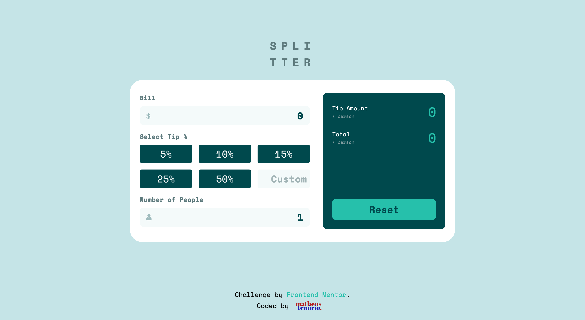
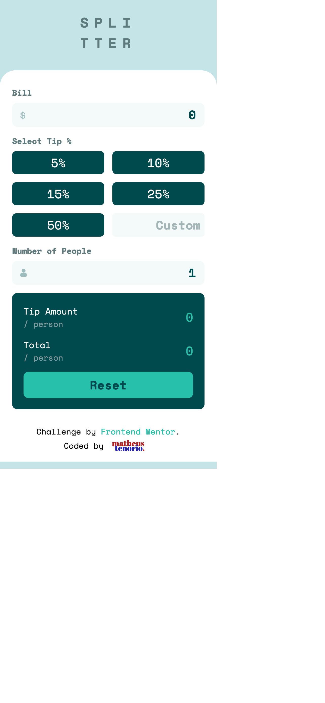

# Frontend Mentor - Tip calculator app solution

This is a solution to the [Tip calculator app challenge on Frontend Mentor](https://www.frontendmentor.io/challenges/tip-calculator-app-ugJNGbJUX). Frontend Mentor challenges help you improve your coding skills by building realistic projects.

## Table of contents

- [Screenshot](#screenshot)
- [Links](#links)
- [Built with](#built-with)
- [Author](#author)

## The challenge

Users should be able to:

- View the optimal layout for the app depending on their device's screen size
- See hover states for all interactive elements on the page
- Calculate the correct tip and total cost of the bill per person

## Screenshot

## Links

- Solution URL: [[GitHub](https://github.com)](https://github.com/im-voracity/tip-calculator)
- Live Site URL: [Splitter](https://splitter.matheustenorio.com)

## Built with

- Semantic HTML5 markup
- CSS custom properties
- Flexbox
- CSS Grid
- Mobile-first workflow

## Author

- Website - [Matheus Tenório](https://www.matheustenorio.com)
- Frontend Mentor - [@im-voracity](https://www.frontendmentor.io/profile/im-voracity)
- Instagram - [@matt.tenorio](https://www.instagram.com/matt.tenorio)
